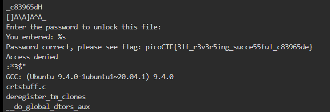

<h1><b>Cryptography: </h1>

<b>Q8.basic-mod2 </b>
We had recieved a list of numbers {22 3  28 26 16 9   26 24 23 10 36 4  16 31 10 34 1 38 9  31 8  26  8} which when mod 41 and then their inverse modulo gave the list {28 ,14 ,22 ,30 ,18 ,32  ,30 ,12 ,25 ,37 ,8  ,31 ,18, 4  ,37 ,35 ,1 ,27 ,32, 4  ,36 ,30,36} which when decoded by thekey given in the question we get the flag ,thus the final flag is  <b>
picoCTF{1nv3r53ly_h4rd_8a05d939}<b>

<h2><b>Reverse Engineering</b></h2>
<b>Q1.Reverse</b> 
commands executed on webshell: 
wget https://artifacts.picoctf.net/c/270/ret 
cat ret gives the text of the file which has the flag in it 

<h3><b>Web Exploitation</b></h3>
Q1.Cookies
picoCTF{3v3ry1_l0v3s_c00k135_bb3b3535}