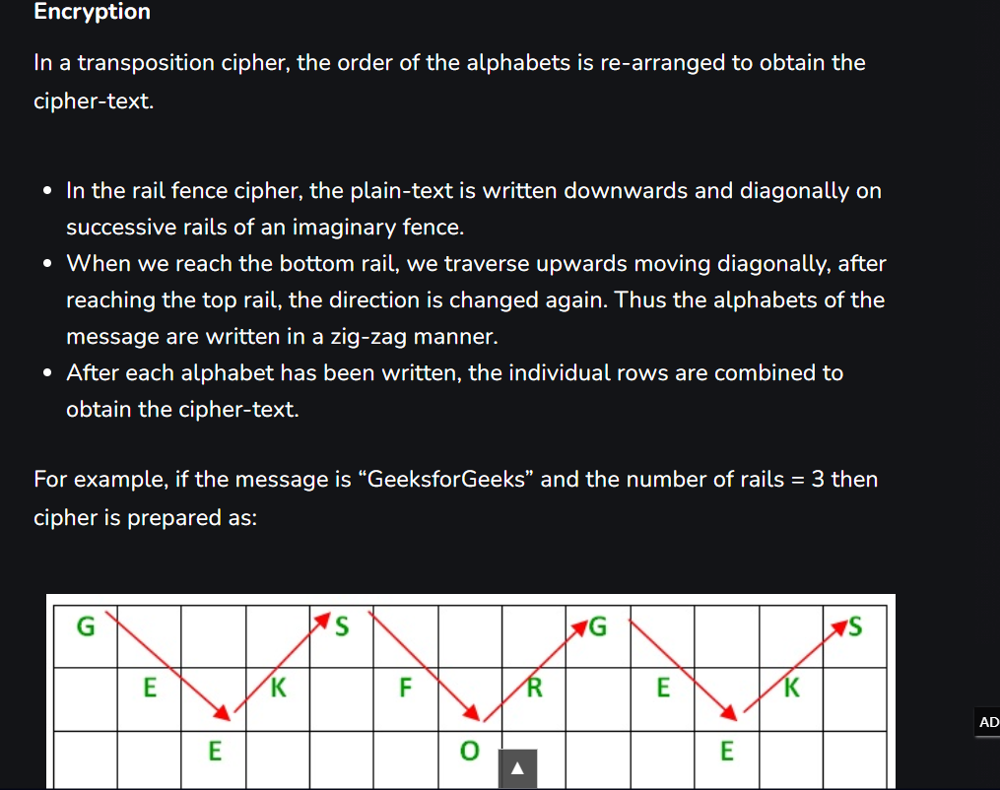

<h1><b>Cryptography: </h1>
Q1.mod 26:

 
Text given: </b>cvpbPGS{arkg_gvzr_V'yy_gel_2_ebhaqf_bs_ebg13_MAZyqFQj}
 

We get the key: picoCTF{next_time_I'll_try_2_rounds_of_rot13_ZNMldSDw}

<b>Q2.Numbers: </b>
Image given:
 
which is coded as A=1,B=2... and so on 
flag is:PICOCTF{THENUMBERSMASON}

<b>Q3.Caeser: </b>
on opening the downloaded file in notepad i recieved the text: 
picoCTF{ynkooejcpdanqxeykjrbdofgkq} 
in which the text wrapped in {} was encoded by caeser cipher,so checking on a online caeser cipher we could brute force this as there were only 25 possibilities,so we got the flag as picoCtf{crossingtherubiconvfhsjkou}

<b>Q4.basic-mod1: </b>
we recive a list of integers frin the question whicch is:

decode these integers by mod 37 using the program writtem,named as mod37calculator(included int the repo) to get 
{17,26,20,13,3,36,13,36,17,26 ,20 ,13 ,3 ,36, 1, 32, 1, 28, 31, 31,29,27}
which can be decoded using the key provided character set: 0-25 is the alphabet (uppercase), 26-35 are the decimal digits, and 36 is an underscore.(done by modifing the code)
we get "R0UND_N_R0UND_B6B25531" ie the flag is  
picoCTF{R0UND_N_R0UND_B6B25531}

<b>Q5.Morse-code </b>
The audio file provided can be opened in audio file editing software like audacity,where we can see the diffeent pulses of the morse code,and thus decode it to get
picoCTF{wh47_h47h_90d_w20u9h7}

<b>Q6.rotation </b>
We were given the text:xqkwKBN{z0bib1wv_l3kzgxb3l_7l140864} 
So it looked like the normal flag so x-->p which is adding 18 or shifting by r.thus using an online caeser cipher we got the flag: 
picoCTF{r0tat1on_d3crypt3d_7d140864}

<b>Q7.rail-fence </b>

 so according to this it can be decoded by hand or using an online tool;on decoding this we get: The flag is: WH3R3_D035_7H3_F3NC3_8361N_4ND_3ND_4A76B997 
<b>picoCTF{WH3R3_D035_7H3_F3NC3_8361N_4ND_3ND_4A76B997}</b>

<b>Q8.basic-mod2 </b>
We had recieved a list of numbers {22 3  28 26 16 9   26 24 23 10 36 4  16 31 10 34 1 38 9  31 8  26  8} which when mod 41 and then their inverse modulo gave the list {28 ,14 ,22 ,30 ,18 ,32  ,30 ,12 ,25 ,37 ,8  ,31 ,18, 4  ,37 ,35 ,1 ,27 ,32, 4  ,36 ,30,36} which when decoded by thekey given in the question we get the flag ,thus the final flag is  <b>
picoCTF{1nv3r53ly_h4rd_8a05d939}<b>

<h2><b>Reverse Engineering</b></h2>
<b>Q1.Reverse</b> 
commands executed on webshell: 
wget https://artifacts.picoctf.net/c/270/ret 
cat ret gives the text of the file which has the flag in it 

<h3><b>Web Exploitation</b></h3>
Q1.Cookies
picoCTF{3v3ry1_l0v3s_c00k135_bb3b3535}